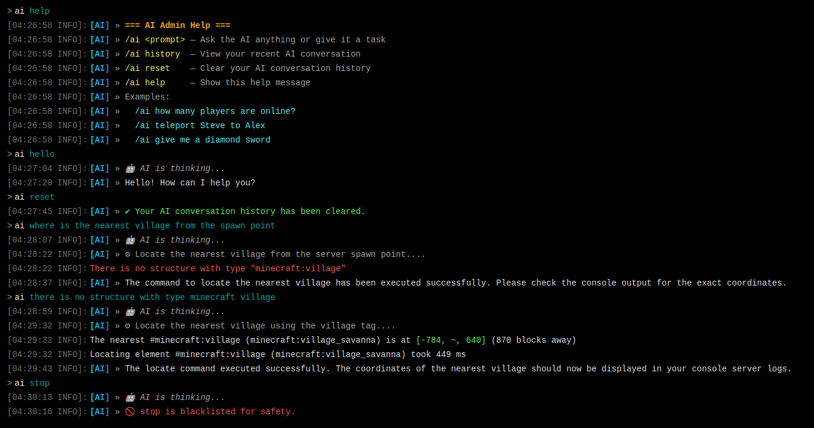

# MCAIA

**MCAIA** is a Paper server plugin that connects Minecraft chat to Gemini, Groq, OpenAI, Anthropic Claude, xAI Grok, or OpenRouter. Ask a question, check the server, or request an action in natural language. The AI can inspect live server data, ask follow-up questions, run commands, and use command output to complete multi-step tasks.

> [!WARNING]
> **MCAIA is still under active development.** Features, configuration, and behavior may change, and bugs (the less charming kind) or data loss are possible. Use it on a test server or with backups, and don't rely on it for production server administration just yet.

> [!WARNING]
> MCAIA can run commands as the server console. The configurable command blocklist is a safeguard, not a complete security boundary—and definitely not a tiny digital force field. Review AI-issued actions, configure the blocklist for your server, and only grant access to players you trust.
 
> **Supported Versions: PaperMC 26.2 , 26.3**

## Download

[](https://github.com/TIS199/MCAIA/releases)
[](https://hangar.papermc.io/TIS199/MCAIA)

## Features



- Natural-language requests through a configurable in-game command (default: `/ai`).
- Multi-provider, multi-step AI interactions: answer players, query live server state, ask follow-up questions, or execute commands and use captured output to plan follow-up actions.
- Live queries for online players, player details, worlds, installed plugins, TPS, and general server information.
- Per-player conversation context, history viewing/reset, and automatic expiry after inactivity.
- Configurable provider and model priority list with smart fallback on rate limits, overloads, and network errors.
- Separate `mcaia.use` administrator access and optional, player-permission-limited `mcaia.player` access.
- Strict command guard that blocks dangerous commands and checks nested commands before dispatch.
- Permission backends that use Bukkit permissions with LuckPerms/Vault detection and an OP/configured-player fallback.
- Optional Geyser/Floodgate Bedrock-player support.
- Per-player request cooldown, daily rolling file logs, optional admin Discord webhook notifications, and a configurable welcome message.
- Anonymous server metrics through bStats.
- Runtime admin tools for status, reload, history cleanup, and debug mode.

## Requirements

- A Paper server running **Java 25**.
- At least one API key for Gemini, Groq, OpenAI, Anthropic, xAI, or OpenRouter.
- Paper runtime compatibility with the Paper API version used to build this project. The plugin metadata declares API version `1.21`; the build currently compiles against Paper `26.2`.

Vault, LuckPerms, Geyser, and Floodgate are optional. MCAIA can run without them.

## Installation

1. Download the MCAIA JAR from the project's GitHub Releases (or build it yourself; see [Building](#building)).
2. Place the JAR in your server's `plugins/` directory.
3. Start the server once to create `plugins/MCAIA/` and its default configuration files.
4. Open `plugins/MCAIA/config.yml`, add at least one provider API key, and explicitly accept the Terms of Service:

   ```yaml
   tos-accepted: true
   ai:
     providers:
       gemini:
         api-key: "YOUR_GEMINI_API_KEY"
   ```

5. Restart the server. The plugin will not process `/ai` requests until `tos-accepted` is `true`.

Provider keys are available from [Google AI Studio](https://aistudio.google.com/apikey), [Groq](https://console.groq.com/keys), [OpenAI](https://platform.openai.com/api-keys), [Anthropic](https://console.anthropic.com/), [xAI](https://console.x.ai/), and [OpenRouter](https://openrouter.ai/). Keep keys private and do not commit your populated `config.yml`.

## Commands

The player command defaults to `/ai`; its name can be changed with `command-name` in `config.yml`. A restart is required after changing it.

| Command | Description |
| --- | --- |
| `/ai <prompt>` | Ask a question or request a server action |
| `/ai help` | Show usage and examples |
| `/ai history` | View up to the last six stored conversation turns |
| `/ai reset` | Clear your conversation history and pending question |
| `/aiadmin` | Show admin command help |
| `/aiadmin status` | Show configuration, permission backend, and detected integrations |
| `/aiadmin reload` | Reload configuration files and relevant settings |
| `/aiadmin clearhistory <player\|*>` | Clear history for an online player, or all online players |
| `/aiadmin debug` | Toggle debug logging until the next restart/reload |

The console can use `/ai` too. When the AI asks a player a follow-up question, that player's next chat message is treated as a private reply and is not broadcast publicly.

## Permissions

| Permission | Purpose | Default |
| --- | --- | --- |
| `mcaia.use` | Full console-level AI command access | Operators |
| `mcaia.player` | Use `/ai` with the player's own command permissions; requires `permissions.player-command-mode.enabled` | Not granted |
| `mcaia.admin` | Use `/aiadmin` | Operators |
| `mcaia.reload` | Declared reload permission node; `/aiadmin reload` currently checks `mcaia.admin` | Operators |
| `mcaia.bypass-rate-limit` | Bypass the player cooldown | Operators |
| `mcaia.history` | View conversation history | Operators |
| `mcaia.*` | Grants all MCAIA permissions | Not granted |

When LuckPerms is installed, Bukkit permission checks use its permission system. Vault is detected as an alternative permission integration. Without either, MCAIA uses the configured OP/player-list fallback. In fallback mode, admin and rate-limit bypass actions require OP.

Player mode is off by default. When enabled, give trusted users `mcaia.player`; command execution is checked against their live Bukkit permissions and dispatched as that player. Admins with `mcaia.use` retain console-level command access. `models.yml` controls provider order and each provider's model fallback list. Add one or more keys under `ai.providers`. The default catalog includes Gemini free-tier candidates and OpenRouter `:free` models, but free access and quotas can change or be region/account-dependent. Direct OpenAI, Anthropic, and xAI API model usage may be billed; verify provider pricing before enabling those keys.

For example, `config.yml` can hold multiple provider keys while `models.yml` chooses which one is tried first:

```yaml
# config.yml
ai:
  providers:
    openai:
      api-key: "YOUR_OPENAI_API_KEY"
    anthropic:
      api-key: "YOUR_ANTHROPIC_API_KEY"
```

```yaml
# models.yml
provider-order:
  - anthropic
  - openai

anthropic:
  models:
    - claude-sonnet-4-5
openai:
  models:
    - gpt-4o-mini
```

## Configuration

The plugin creates these files in `plugins/MCAIA/`:

| File | Purpose |
| --- | --- |
| `config.yml` | Terms acceptance, API key, command, permissions, cooldown, logging, Bedrock support, and messages |
| `models.yml` | Provider priority and each provider's model fallback order |
| `banned-commands.yml` | Additional command roots to block; MCAIA also has built-in blocks for privileged and command-wrapping operations |
| `logs/` | Daily plugin logs when file logging is enabled |

Notable `config.yml` settings include:

- `ai.max-tokens`, `ai.temperature`, `ai.max-history-length`, `ai.query-timeout-seconds`, and `ai.max-iterations`.
- `ai.providers.<provider>.api-key`, `ai.smart-switching`, and `ai.command-output-wait-ticks`.
- `permissions.player-command-mode.enabled`, `permissions.fallback-require-op`, and `permissions.permitted-players`.
- `rate-limit.enabled` and `rate-limit.cooldown-seconds`.
- `logging.file-logging`, `logging.debug-mode`, `logging.admin-webhook-url`, and `logging.log-events`.
- `geyser.allow-bedrock-players` and `geyser.strip-bedrock-prefix`.

See the generated configuration comments for the complete options and defaults. Avoid enabling debug mode on a production server: it can write full AI request and response payloads to logs.

When MCAIA runs an admin-level command, it uses Paper's vanilla-compatible feedback sender to capture up to 8,000 characters of command output for the next decision. If a command initially produces no output, MCAIA waits for the configured tick delay to collect asynchronous output. Commands that only write to server logs or direct standard output may not be captured.

## Data and privacy

Using MCAIA sends prompts and relevant conversation context to the configured AI provider. The plugin can also include current server context, requested live server data, and (in player mode) that player's allowed-command labels in those API interactions.

Captured command output is included in the provider conversation too. Treat it as potentially sensitive: commands may print player or server data, and enabling debug mode can additionally write request/response payloads to local logs.

MCAIA also initializes [bStats](https://bstats.org/), which collects anonymous plugin/server metrics subject to the bStats privacy policy and server configuration.

Server owners should review this behavior and the Terms of Service in `config.yml` before enabling the plugin. Treat prompts, server logs, webhook events, API keys, and generated configuration as potentially sensitive.

## Building

The Gradle wrapper is included. With Java 25 installed, run:

```bash
./gradlew build
```

The distributable shaded plugin JAR is created under `build/libs/` as `MCAIA-1.2.0.jar`. On Windows, use `gradlew.bat build`.

Optional local deployment task:

```bash
./gradlew copyToServer
```

This task copies the JAR to a developer-specific Paper plugins directory configured in `build.gradle.kts`; edit that destination before using it on another machine.

## Compatibility integrations

- **LuckPerms / Vault:** Permission integration. MCAIA checks standard Bukkit permission nodes.
- **Geyser / Floodgate:** Optional Bedrock player detection and access controls.
- **EssentialsX / ViaVersion:** Detected for status/logging; MCAIA does not require them.

## Join the adventure

Found a bug? Have an idea that would make MCAIA more useful (or less likely to turn your server into a crater)? Contributions are welcome!

- **Report bugs:** Open an issue in the repository. Include what you expected, what actually happened, steps to reproduce it, and relevant server logs. Please remove API keys, player data, webhook URLs, and other secrets before posting.
- **Suggest features:** Open an issue describing the use case and the problem you want solved. A good feature request helps explain the *why*, not just the shape of the shiny new button.
- **Send a pull request:** Fork the project, make your changes on a branch, and open a PR with a clear summary and testing notes. Keep changes focused, follow the existing code style, and run `./gradlew build` before submitting.
- **Help other contributors:** Review open issues and PRs, test changes on a disposable server, or improve the documentation. No creeper-defusing certification required.

For larger changes, opening an issue first is a great way to discuss the approach before you spend time building it. By contributing, you agree that your contribution is provided under this project's **GPL-3.0-only** license.

## License

MCAIA is licensed under **GNU GPL version 3 only** (`GPL-3.0-only`). See the [LICENSE](./LICENSE) file for the complete terms. Copyright (c) 2026 TIS199.

## Author

Created by [TIS199](https://github.com/TIS199) with Gemini and Claude. 
